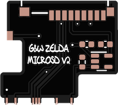
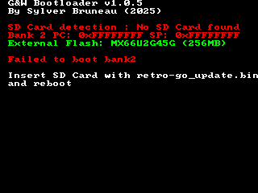
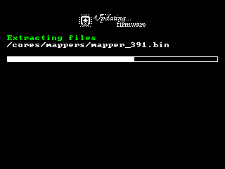

# Nintendo® Game & Watch™ Retro-Go SD

A comprehensive emulator collection for the Nintendo® Game & Watch™ with SD Card support, allowing you to play your favorite retro games on the go!

## Table of Contents
- [Support Development](#support-development)
- [Features](#features)
- [Installation](#installation)
  - [Pre-modded Options](#pre-modded-options)
  - [Hardware Requirements](#hardware-requirements)
  - [Installation Steps](#installation-steps)
- [Supported Systems](#supported-systems)
  - [Emulators](#emulators)
  - [SNES Ports](#snes-ports)
  - [Homebrew Ports](#homebrew-ports)
- [Controls](#controls)
  - [Button Mappings](#button-mappings)
  - [Macros](#macros)
- [Troubleshooting / FAQ](#troubleshooting--faq)
- [Cheat Codes](#cheat-codes)
  - [Cheat codes on NES System](#cheat-codes-on-nes-system)
  - [Cheat codes on GB System](#cheat-codes-on-gb-system)
  - [Cheat codes on PCE System](#cheat-codes-on-pce-system)
  - [Cheat codes on MSX System](#cheat-codes-on-msx-system)
- [NES Emulator](#nes-emulator)
- [MSX Emulator](#msx-emulator)
- [Amstrad CPC6128 Emulator](#amstrad-cpc6128-emulator)
- [Vectrex/Odyssey2 Emulator](#vectrexodyssey2-emulator)
- [Homebrew ports](#homebrew-ports)
  - [The Legend of Zelda: A Link to the Past](#the-legend-of-zelda-a-link-to-the-past)
    - [Alternate languages](#alternate-languages)
  - [Super Mario World](#super-mario-world)
  - [Celeste Classic](#celeste-classic)
- [Discord, support and discussion](#discord-support-and-discussion)
- [License](#license)

## Support Development

You can support the development by donating via [PayPal](https://paypal.me/revlys)

## Features

- 🎮 Support for multiple retro gaming systems
- 💾 SD Card storage for ROMs and games
- 💾 4 save state slots per game
- 🎨 Cover art support
- 🔄 Easy firmware updates
- 🌐 Unicode support (Latin and Cyrillic, more to come)
- 🎯 Cheat code support for multiple systems
- 🔄 Dual boot capability (original firmware preservation)

Current limitations :
- Up to 1000 roms/disks will be visible for each system
- Disk change is not available for MSX and Amstrad systems
- CJK characters not yet visible

## Installation

### Pre-modded Options

If you prefer professional installation, contact:
- **Europe**: Sylver ([u/Sylver7667](https://www.reddit.com/user/Sylver7667/) on Reddit, sylver__ on Discord)
- **USA**: hundshamer ([u/hundshamer](https://www.reddit.com/user/hundshamer/) on Reddit)


### Hardware Requirements

To install the hardware mod, you need:

- SD Card PCB adapter (Zelda version only for now, Mario version coming soon) : [Gerber file](assets/GnW_SD_v2.zip) (credits to Tim Schuerewegen for initial version and hundshamer for updates to make it easier to install)

   

- 1x MX25U51245GZ4I00 (64MB SPI flash 1.8v) or bigger
- 1x 0402 100k resistor
- 2x 0402 1uf
- 1x RT9193-28GB LDO regulator
- 1x Micro SD card slot SMD 9Pin ([here](https://www.aliexpress.com/item/1005002829329826.html), [here](https://www.aliexpress.com/item/1005001331379046.html), [here](https://www.aliexpress.com/item/32802051702.html), ...)

### Installation Steps

1. **Original Firmware Backup / Unlock**
   - Install [gnwmanager](https://github.com/BrianPugh/gnwmanager), follow [installation instructions](https://github.com/BrianPugh/gnwmanager/blob/main/tutorials/installation.md)
   - Connect your JTAG device (ST-Link v2 or others supported devices)
   - Run `gnwmanager unlock` to backup and unlock the console. Follow instructions on computer's screen with attention.
   - If you already have a backup, use `gnwmanager unlock --no-backup` to skip the backup steps

2. **Patched OFW / Bootloader Installation**
   - For dual boot (recommended):
     ```bash
     gnwmanager flash-patch zelda internal_flash_backup_zelda.bin flash_backup_zelda.bin --bootloader
     ```
   - Without dual boot (not recommended):
     ```bash
     gnwmanager flash-bootloader bank1
     ```

3. **Flash Chip Installation**
   - Install the MX25U51245GZ4I00 flash chip, follow instructions in [this video](https://www.youtube.com/watch?v=mYvK7LyHh1Y) if needed
   - You can use bootloader to check that your flash chip is correctly installed. Power on the console (and press GAME+Left if patched OFW is installed) to run the bootloader. You should see a screen like this:

      

      > Note: If you installed the recommended 64MB chip, you should see "MX25U51245G (64MB)" on the screen.

4. **SD Card Mod Installation**
   
   TBC

5. **Retro-Go-SD Installation**
   - Format micro SD card as exFAT (recommended) or FAT32
   - Download latest `retro-go_update.bin` from [releases page](https://github.com/sylverb/game-and-watch-retro-go-sd/releases/latest)
   - Place the file in the root folder of your SD card
   - Insert SD card and start the console

      
   - You can start filling the created folders on your sd card with uncompressed roms (in /roms/gb, roms/gbc, roms/nes, ...)

## Supported Systems

### Emulators
- Amstrad CPC6128 (beta)
- Atari 7800
- ColecoVision
- Gameboy / Gameboy Color
- Game & Watch / LCD Games
- MSX1/2/2+
- Nintendo Entertainment System
- PC Engine / TurboGrafx-16
- Sega Game Gear
- Sega Genesis / Megadrive
- Sega Master System
- Sega SG-1000
- Tamagotchi P1
- Watara Supervision

### SNES Ports
- The Legend of Zelda: A Link to the Past
- Super Mario World

### Homebrew Ports
- Celeste Classic

## Controls

### Button Mappings
- `GAME` → `START`
- `TIME` → `SELECT`
- `PAUSE/SET` → Emulator menu

### Macros
| Button combination    | Action                                                                 |
| --------------------- | ---------------------------------------------------------------------- |
| `PAUSE/SET` + `GAME`  | Store a screenshot (Disabled by default on 1MB flash builds)          |
| `PAUSE/SET` + `TIME`  | Toggle speedup (1x/1.5x)                                               |
| `PAUSE/SET` + `UP`    | Brightness up                                                          |
| `PAUSE/SET` + `DOWN`  | Brightness down                                                        |
| `PAUSE/SET` + `RIGHT` | Volume up                                                              |
| `PAUSE/SET` + `LEFT`  | Volume down                                                            |
| `PAUSE/SET` + `B`     | Load state                                                             |
| `PAUSE/SET` + `A`     | Save state                                                             |
| `PAUSE/SET` + `POWER` | Poweroff without save-state                                            |

## Troubleshooting / FAQ

TBC

## Cheat codes

Note: Currently cheat codes are only working with GB, GBC, NES, PCE and MSX games.

To enable, add CHEAT_CODES=1 to your make command. If you have already compiled without CHEAT_CODES=1, I recommend running make clean first.
To enable or disable cheats, select a game then select "Cheat Codes". You will be able to select cheats you want to enable/disable. Then you can start/resume a game and selected cheats will be applied.
On GB, GBC and MSX systems, you can enable/disable cheats during game.

### Cheat codes on NES System

To add Game Genie codes, create a file ending in .ggcodes in the /cheats/nes/ directory with the same name as your rom. For instance, for
"/roms/nes/Super Mario Bros.nes" make a file called "/cheats/nes/Super Mario Bros.ggcodes". In that file, each line can have up to 3 Game Genie codes and a maximum
of 16 lines of active codes (for a max of 3 x 16 = 48 codes). Each line can also have a description (up to 25 characters long).
You can comment out a line by prefixing with # or //. For example:
```
SXIOPO, Inf lives
APZLGG+APZLTG+GAZUAG, Mega jump
YSAOPE+YEAOZA+YEAPYA, Start on World 8-1
YSAOPE+YEAOZA+LXAPYA, Start on World -1
GOZSXX, Invincibility
# TVVOAE, Circus music
```
You can enable / disable each of your codes in the game selection screen.

A collection of codes can be found [here](https://github.com/martaaay/game-and-watch-retro-go-game-genie-codes).

### Cheat codes on GB System

To add Game Genie/Game Shark codes, create a file ending in .ggcodes in the /cheats/gb/ or /cheats/gbc/ directory with the same name as your rom. For instance, for
"/roms/gb/Wario Land 3.gb" make a file called "/cheats/gb/Wario Land 3.ggcodes". In that file, each line can have several Game Genie / Game Shark codes
(separate them using a +) and a maximum of 16 lines of active codes. Each line can also have a description (up to 25 characters long).
You can comment out a line by prefixing with # or //. For example:
```
SXIOPO, Inf lives
APZLGG+APZLTG+GAZUAG, Mega jump
YSAOPE+YEAOZA+YEAPYA, Start on World 8-1
YSAOPE+YEAOZA+LXAPYA, Start on World -1
GOZSXX, Invincibility
# TVVOAE, Circus music
```
You can enable / disable each of your codes in the game selection screen or during game.

### Cheat codes on PCE System

Now you can define rom patch for PCE Roms. You can found patch info from [Here](https://krikzz.com/forum/index.php?topic=1004.0).
To add PCE rom patcher, create a file ending in .pceplus in the /cheats/pce/ directory with the same name as your rom. For instance, for
"/roms/pce/1943 Kai (J).pce" make a file called "/cheats/pce/1943 Kai (J).pceplus".
A collection of codes file can be found [here](https://github.com/olderzeus/game-genie-codes-nes/tree/master/pceplus).

Each line of pceplus is defined as:
```
01822fbd,018330bd,0188fcbd,	Hacked Version
[patchcommand],[...], patch desc

```

Each patch command is a hex string defined as:
```
01822fbd
_
|how much byte to patched
 _____
   |patch start address, subtract pce rom header size if had.
      __...
       |bytes data to patched from start address

```
### Cheat codes on MSX System

You can use blueMSX MCF cheat files with your Game & Watch. A nice collection of patch files is available [Here](http://bluemsx.msxblue.com/rel_download/Cheats.zip).
Just copy the wanted MCF files in the /cheats/msx/ folder with the same name as the corresponding rom/dsk file.
On MSX system, you can enable/disable cheats while playing. Just press the Pause/Set button and choose "Cheat Codes" menu to choose which cheats you want to enable or disable.

## NES Emulator

NES emulation was done using nofrendo-go emulator, it doesn't have the best compatibility but has good performances.
To handle eveything that is not or badly emulated by nofrendo, fceumm emulator has been ported too.
fceumm has very good compatibility but it's using more CPU power, currently about 65-85% of CPU depending on games, disks games (FDS) are taking even more CPU power (about 95%).
Due to the large amount of mappers supported by fceumm, it's not possible to embbed all mappers codes in the G&W memory, so the parsing proccess is listing mappers used by games in the rom/nes folder so only needed mappers are loaded in the G&W. If you are using too much different mappers in the games you have selected, you will have runtime problems. The maximum number of mappers you can use will depends on embedded mappers, but basically it should fit most needs.

Mappers compatibility is basically the same as fceumm version from 01/01/2023. Testing all mappers is not possible, so some mappers that could try to allocate too much ram will probably crash. If you find any mapper that crash, please report on discord support, or by opening a ticket on github.

As Game & Watch CPU is not able to emulate YM2413 at 48kHz, mapper 85 (VRC-7) sound will play at 18kHz instead of 48kHz.

FDS support requires you to put the FDS firmware in `/bios/nes/disksys.rom` file

Note that you can force nofrendo-go usage instead of fceumm by adding FORCE_NOFRENDO=1 option in your make command

## MSX Emulator

MSX system is a computer with a keyboard and with multiple extensions possible (like sound cartridges).
The system needs bios files to be in the roms/msx_bios folder. Check roms/msx_bios/README.md file for details.

What is supported :
- MSX1/2/2+ system are supported. MSX Turbo-R will probably not work on the G&W.
- ROM cartridges images : roms have to be named with rom, mx1 or mx2 extension.
- Disks images : disks images have to be named with dsk extension. Due to memory constraints, disks images are read only. Multiple disks games are supported and user can change the current disk using the "Pause/Options/Change Dsk" menu.
- Cheat codes support (MCF files in old or new format as described [Here](http://www.msxblue.com/manual/trainermcf_c.htm))
- The file roms/msx_bios/msxromdb.xml contains control profiles for some games, it allows to configure controls in the best way for some games. If a game has no control profile defined in msxromdb.xml, then controls will be configured as joystick emulation mode.
- Sometimes games require the user to enter his name using the keyboard, and some games like Metal Gear 1/2 are using F1-F5 keys to acces items/radio/... menus. It is possible to virtually press these keys using the "Pause/Options/Press Key" menu.

Note that the MSX support is done using blueMsx 2.8.2, any game that is not working correctly using this emulator will not work on the Game & Watch. To fit in the G&W, a some features have been removed, so it's possible that some games running on blueMSX will not work in the G&W port. The emulator port is still in progress, consider it as a preview version.

## Amstrad CPC6128 Emulator

Amstrad CPC6128 system is a computer with a keyboard and disk drive.

What is supported :
- Amstrad CPC6128 system is the only supported system. CPC464 could be added if there is any interest in doing this. Note that CPC464+/6128+ systems are not supported (running a around 40% of their normal speed so it has been removed)
- Disks images : disks images have to be named with dsk extension. Due to memory constraints, disks images are read only. Multiple disks games are supported and user can change the current disk using the "Pause/Options/Change Dsk" menu.  Both standard and extended dsk format are supported, moreover a compression mechanism specific to the G&W has been implemented to reduce the size of disk images. Disk compression is automatically handled during the build process.
- Normally when the amstrad system starts, it will wait the user to enter a run"file or |CPM command to load the content of the disk. As it's not very friendly, the emulator is detecting the name of the file to run and enter automatically the right commant at startup
- Sometimes games require the user to enter his name using the keyboard. It is possible to virtually press these keys using the "Pause/Options/Press Key" menu.
- Amstrad screen resolution is 384x272 pixels while G&W resolution is 320x240. The standard screen mode (with no scaling) will show the screen without the borders which will be ok in most cases, but in some cases games are using borders to show some content. If you want to see the whole Amstrad screen on the G&W, set options/scaling to "fit".

Tape support has not been ported, if there is any interest in adding this, it could be considered.

Note that the Amstrad CPC6128 support is done using caprice32 emulator, any game that is not working correctly using this emulator will not work on the Game & Watch. To fit in the G&W, a some features have been removed, so it's possible that some games running on caprice32 will not work in the G&W port. The emulator port is still in progress, consider it as a preview version.

## Vectrex/Odyssey2 Emulator
Vectrex/Odyssey2 is provided by a modified version of o2em emulator.
Support is currently in development so it's unstable, has lots of bugs and it's not really playable.
To play, you need a bios file, for now rename your bios file to bios.bin and put it in the roms/vectrex folder

## Homebrew ports

Some homebrew/SNES games have been _ported_ to the G&W.

### The Legend of Zelda: A Link to the Past

To play The Legend of Zelda: A Link to the Past, you need to generate the zelda3_assets.dat file by following these steps :
- copy zelda3.sfc (USA version, sha1 = '6d4f10a8b10e10dbe624cb23cf03b88bb8252973') rom to external/zelda3/tables/
- run 'make -C external/zelda3 tables/zelda3_assets.dat' command

The file zelda3_assets.dat will be created in external/smw. Copy the zelda3_assets.dat file in /roms/homebrew/ folder of your sd card.

If you want to create zelda3_assets.dat file with several languages, the steps are :
- copy all zelda3_xx.sfc files (including us zelda3.sfc) from languages you want to include (check names and sha1 below)
- go in tables folder : 'cd external/zelda3/tables'
- for each rom run this command : 'python3 restool.py --extract-dialogue -r ./zelda3_xx.sfc' (replace _xx with real rom names)
- run the command to build assets file : 'python3 restool.py --extract-from-rom --languages=fr,fr-c,de,en,es,pl,pt,nl' (adapt the languages list to fit the languages you did provide)

The file zelda3_assets.dat will be created in external/smw. Copy the zelda3_assets.dat file in /roms/homebrew/ folder of your sd card.

When playing, you'll be able to change current language by going in the options menu.

Due to the limited set of buttons (especially on the Mario console), the controls are peculiar:

| Description | Binding on Mario units | Binding on Zelda units |
| ----------- | ---------------------- | ---------------------- |
| `A` button (Pegasus Boots / Interacting) | `A` | `A` |
| `B` button (Sword) | `B` | `B` |
| `X` button (Show Map) | `GAME + B` | `TIME` |
| `Y` button (Use Item) | `TIME` | `SELECT` |
| `Select` button (Save Screen) | `GAME + TIME` | `GAME + TIME` |
| `Start` button (Item Selection Screen) | `GAME + A` | `START` |
| `L` button (Quick-swapping, if enabled) | `-` | `GAME + B` |
| `R` button (Quick-swapping, if enabled) | `-` | `GAME + A` |

Some features can be configured with flags:

| Build flag    | Description |
| ------------- | ------------- |
| `LIMIT_30FPS` | Limit to 30 fps for improved stability.<br>Enabled by default.<br>Disabling this flag will result in unsteady framerate and stuttering. |
| `FASTER_UI` | Increase UI speed (item menu, etc.).<br>Enabled by default. |
| `BATTERY_INDICATOR` | Display battery indicator in item menu.<br>Enabled by default. |
| `FEATURE_SWITCH_LR` | Item switch on L/R. Also allows reordering of items in inventory by pressing Y+direction.<br>Hold X, L, or R inside of the item selection screen to assign items to those buttons.<br>If X is reassigned, Select opens the map. Push Select while paused to save or quit.<br>When L or R are assigned items, those buttons will no longer cycle items. |
| `FEATURE_TURN_WHILE_DASHING` | Allow turning while dashing. |
| `FEATURE_MIRROR_TO_DARK_WORLD` | Allow mirror to be used to warp to the Dark World. |
| `FEATURE_COLLECT_ITEMS_WITH_SWORD` | Collect items (like hearts) with sword instead of having to touch them. |
| `FEATURE_BREAK_POTS_WITH_SWORD` | Level 2-4 sword can be used to break pots. |
| `FEATURE_DISABLE_LOW_HEALTH_BEEP` | Disable the low health beep. |
| `FEATURE_SKIP_INTRO_ON_KEYPRESS` | Avoid waiting too much at the start.<br>Enabled by default. |
| `FEATURE_SHOW_MAX_ITEMS_IN_YELLOW` | Display max rupees/bombs/arrows with orange/yellow color. |
| `FEATURE_MORE_ACTIVE_BOMBS` | Allows up to four bombs active at a time instead of two. |
| `FEATURE_CARRY_MORE_RUPEES` | Can carry 9999 rupees instead of 999. |
| `FEATURE_MISC_BUG_FIXES` | Enable various zelda bug fixes. |
| `FEATURE_CANCEL_BIRD_TRAVEL` | Allow bird travel to be cancelled by hitting the X key. |
| `FEATURE_GAME_CHANGING_BUG_FIXES` | Enable some more advanced zelda bugfixes that change game behavior. |
| `FEATURE_SWITCH_LR_LIMIT` | Enable this to limit the ItemSwitchLR item cycling to the first 4 items. |

#### Alternate languages

By default, dialogues extracted from the US ROM are in english. You can replace dialogues with another language by using a localized ROM file. Supported alternate languages are:

| Language | Origin | Naming | SHA1 hash |
| -------- | ------ | ------ | --------- |
| German   | Original | zelda3_de.sfc | 2E62494967FB0AFDF5DA1635607F9641DF7C6559 |
| French   | Original | zelda3_fr.sfc | 229364A1B92A05167CD38609B1AA98F7041987CC |
| French (Canada) | Original | zelda3_fr-c.sfc | C1C6C7F76FFF936C534FF11F87A54162FC0AA100 |
| English (Europe) | Original | zelda3_en.sfc | 7C073A222569B9B8E8CA5FCB5DFEC3B5E31DA895 |
| Spanish  | Romhack | zelda3_es.sfc | 461FCBD700D1332009C0E85A7A136E2A8E4B111E |
| Polish   | Romhack | zelda3_pl.sfc | 3C4D605EEFDA1D76F101965138F238476655B11D |
| Portuguese | Romhack | zelda3_pt.sfc | D0D09ED41F9C373FE6AFDCCAFBF0DA8C88D3D90D |
| Dutch    | Romhack | zelda3_nl.sfc | FA8ADFDBA2697C9A54D583A1284A22AC764C7637 |
| Swedish  | Romhack | zelda3_sv.sfc | 43CD3438469B2C3FE879EA2F410B3EF3CB3F1CA4 |

### Super Mario World

To play Super Mario world you need to copy the smw_assets.dat file in /roms/homebrew/ folder of your sd card.
the smw_assets.dat file can be generated by doing the following steps :
- copy smw.sfc (USA version, sha1 = '6B47BB75D16514B6A476AA0C73A683A2A4C18765') rom to external/smw/assets/
- run 'make -C external/smw smw_assets.dat' command
The file smw_assets.dat will be created in external/smw.

Due to the limited set of buttons (especially on the Mario console), the controls are peculiar:

| Description | Binding on Mario units | Binding on Zelda units |
| ----------- | ---------------------- | ---------------------- |
| `A` button (Spin Jump) | `GAME + A` | `SELECT` |
| `B` button (Regular Jump) | `A` | `A` |
| `X`/`Y` button (Dash/Shoot) | `B` | `B` |
| `Select` button (Use Reserve Item) | `TIME` | `TIME` |
| `Start` button (Pause Game) | `GAME + TIME` | `START` |
| `L` button (Scroll Screen Left) | `-` | `GAME + B` |
| `R` button (Scroll Screen Right) | `-` | `GAME + A` |

Some features can be configured with flags:

| Build flag    | Description |
| ------------- | ------------- |
| `LIMIT_30FPS` | Limit to 30 fps for improved stability.<br>Enabled by default.<br>Disabling this flag will result in unsteady framerate and stuttering. |

### Celeste Classic

This is a port of the Pico-8 version of Celeste Classic. Not a Pico-8 emulator.

## Discord, support and discussion 

Please join the [Discord](https://discord.gg/vVcwrrHTNJ).

## License

This project is licensed under the GPLv2. Some components are available under the MIT license. Respective copyrights apply to each component.
